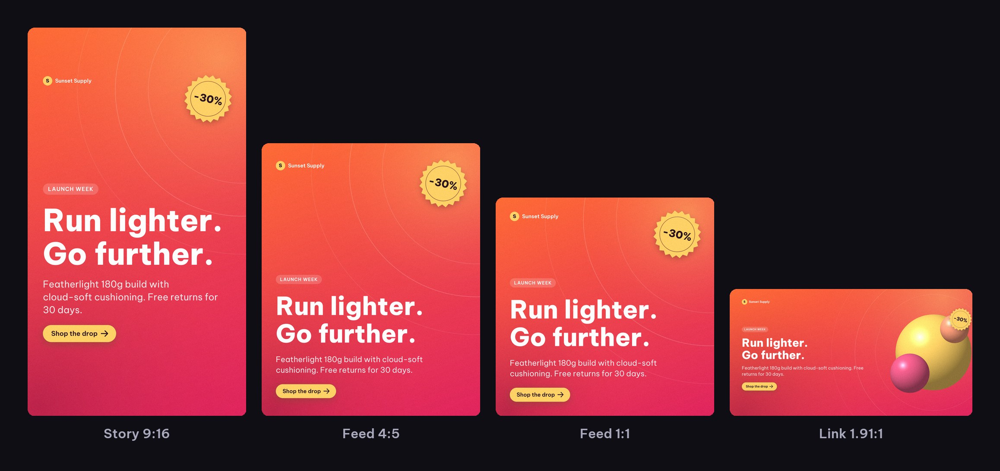
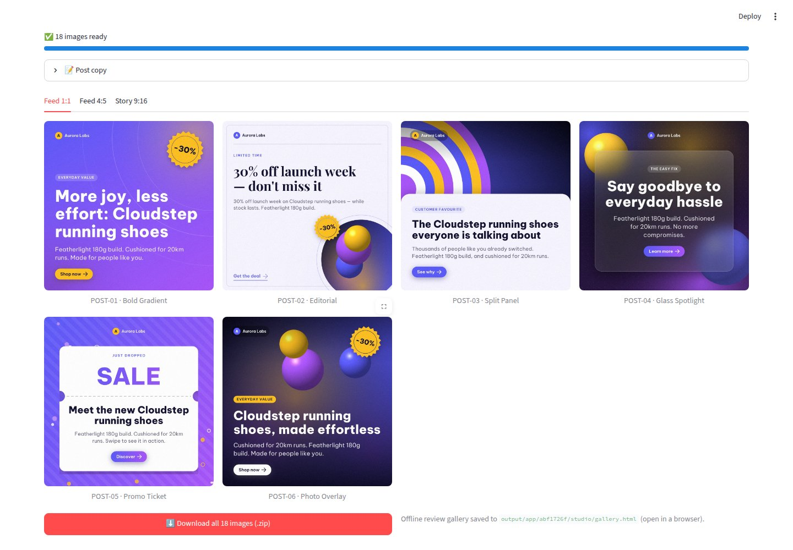
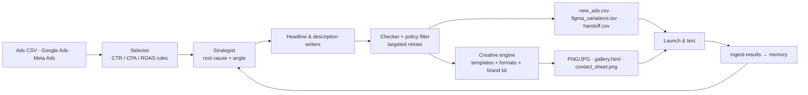

<div align="center">

# Growth Creative Factory

**Open-source creative factory for performance marketers.**
Ad performance data → AI-written copy → on-brand social images for every placement, in bulk.

[](https://github.com/vansyson1308/growth-creative-factory/actions/workflows/ci.yml)


[English](README.md) · [Tiếng Việt](README.vi.md)


<sub>Every image above was rendered by this repo, offline, from a few lines of copy. Brands are fictional.</sub>

</div>

---

## Why

Creative is the biggest lever left in paid social — and the slowest part of the loop.
Teams test a handful of variants a week because each one needs a copywriter, a designer
and a resize for every placement.

Growth Creative Factory closes that loop in one command:

1. **Find what's failing** — import performance (CSV, Google Ads, Meta Ads) and flag
   underperforming ads by CTR / CPA / ROAS.
2. **Write better copy** — Claude (or the built-in offline copywriter) diagnoses the root
   cause, writes headline/description variants across five creative angles, then a checker
   and a policy filter remove anything non-compliant.
3. **Ship images, not spreadsheets** — every variant is rendered into ready-to-upload PNGs
   for Feed 1:1, Feed 4:5, Stories/Reels 9:16, Link 1.91:1 and 16:9, in your brand kit.
4. **Learn** — results flow back into a memory log so the next round avoids losing angles.

## What you get

| | |
|---|---|
| 🎨 **Creative engine** | 6 designer templates × 5 placements, brand kits, auto-fit typography, safe zones for Stories, product photos or generative art. Pure Python (Pillow) — no browser, no Figma required. |
| ✍️ **Copy that fits** | Hard character limits (30/90 by default), no ALL-CAPS, policy blocklist, LLM compliance checker, near-duplicate removal and angle diversity (benefit, urgency, social proof, problem/solution, curiosity). |
| 🌏 **English & Vietnamese** | Bundled OFL fonts with complete Vietnamese diacritics; language-aware copy, CTAs and badges. |
| 🧪 **Dry-run by default** | A context-aware offline copywriter produces on-topic copy for free, so you can try everything without an API key. |
| 🔌 **Connectors** | Google Ads and Meta Ads pulls, Google Sheets handoff, Figma plugin for fully custom layouts. |
| 🧭 **Guardrails** | Call budget, retries with backoff, response cache, refusal handling, strict config validation. |
| 🖥️ **Three interfaces** | CLI, Streamlit app (Creative Studio + Ads Wizard), and a Python API. |



## Quickstart (2 minutes, no API key)

```bash
git clone https://github.com/vansyson1308/growth-creative-factory.git
cd growth-creative-factory
python -m venv .venv && source .venv/bin/activate      # Windows: .venv\Scripts\activate
pip install -e ".[ui]"                                   # or: pip install -r requirements.txt
```

**1 · From ad performance to creatives**

```bash
gcf run --input examples/ads_sample.csv --mode dry
open output/gallery.html        # Windows: start output\gallery.html · Linux: xdg-open
```

**2 · From a product brief to a week of social posts**

```bash
gcf create --product "Cloudstep running shoes" \
  --audience "busy city runners" --offer "30% off launch week" \
  --benefit "Featherlight 180g build" --benefit "Cushioned for 20km runs" \
  --n 8 --brand sunset --formats square,story
```

**3 · From any copy sheet (or the Figma TSV) to images**

```bash
gcf render --input examples/posts_sample.csv --formats all --brand noir
```

**4 · The app**

```bash
streamlit run app.py
```



## Templates


| Key | Name | Best for |
|---|---|---|
| `bold` | Bold Gradient | Scroll-stopping feed ads, launches |
| `editorial` | Editorial | Premium, fashion, lifestyle, B2B thought leadership |
| `split` | Split Panel | Product-first storytelling, e-commerce |
| `glass` | Glass Spotlight | Tech, SaaS, apps, beauty |
| `promo` | Promo Ticket | Sales, coupons, BOGO, seasonal events |
| `photo` | Photo Overlay | Lifestyle photography, travel, food |

Templates rotate automatically across a batch so a test set looks varied. Pin one per row
with a `template` column, or pass `--templates bold,glass`.

## Formats

| Key | Size | Placements |
|---|---|---|
| `square` | 1080×1080 | Facebook & Instagram feed, carousel |
| `portrait` | 1080×1350 | Feed 4:5 (most mobile real estate) |
| `story` | 1080×1920 | Stories, Reels, TikTok, Shorts — with top/bottom safe zones |
| `landscape` | 1200×628 | Facebook link ads, LinkedIn, Google Display |
| `wide` | 1600×900 | X/Twitter, YouTube thumbnails, slides |

## Brand kits

Six presets ship with the repo (`gcf brands`): `aurora`, `sunset`, `verde`, `tide`, `noir`,
`blossom`. For your own brand, copy [`examples/brand_kit.yaml`](examples/brand_kit.yaml),
set colours, logo and fonts, and pass `--brand path/to/brand_kit.yaml` — or set
`render.brand` in `config.yaml`.


## How it works



Every run writes:

| File | What it is |
|---|---|
| `output/creatives/<format>/*.png` | Ready-to-upload images + `manifest.csv` |
| `output/gallery.html` | Filterable review page (format, template, search) — works offline |
| `output/contact_sheet.png` | One-glance overview for Slack / stakeholders |
| `output/new_ads.csv` | Every headline × description combination with unique tags |
| `output/figma_variations.tsv` | Paste into the Figma plugin for custom layouts (UTF-8, no BOM) |
| `output/handoff.csv` | Review sheet with `status` / `notes` columns |
| `output/report.md` | Diagnosis, strategy and stats per ad |

## Live mode (Claude)

```bash
cp .env.example .env     # add ANTHROPIC_API_KEY
gcf run --input input/ads.csv --mode live
gcf create --product "..." --mode live
```

Defaults live in [`config.yaml`](config.yaml): `claude-opus-5`, `effort: low` (short copy
doesn't need deep reasoning), server-side refusal fallbacks, a per-run call budget, retries
with backoff and a SQLite response cache. Sampling parameters are omitted because current
Claude models reject them; set `provider.temperature` only when pinning an older model.

## Python API

```python
from gcf.creative import Creative, render_creative, render_batch

img = render_creative(
    Creative(headline="Run lighter. Go further.",
             description="Featherlight 180g build. Free returns for 30 days.",
             eyebrow="Launch week", badge="-30%"),
    template="bold", fmt="story", brand="sunset",
)
img.save("story.png")

render_batch(creatives, "out/", formats=["square", "story"], brand="brand_kit.yaml")
```

See [docs/CREATIVE_ENGINE.md](docs/CREATIVE_ENGINE.md) for the full reference.

## CLI reference

| Command | Purpose |
|---|---|
| `gcf run` | Full pipeline: select → write → check → render (`--no-render`, `--formats`, `--templates`, `--brand`, `--max-creatives`) |
| `gcf create` | Brief → N social posts → images |
| `gcf render` | Any CSV/TSV with a `headline` column → images |
| `gcf showcase` | Rebuild the showcase (`--readme-assets` for the images in this README) |
| `gcf templates` · `gcf formats` · `gcf brands` | List what's available |
| `gcf google-ads pull` · `gcf meta-ads pull` | Pull performance into the unified schema |
| `gcf sheets push` | Push outputs to Google Sheets |
| `gcf ingest-results` | Feed test results back into memory |

## Connectors & Figma

- [Connect Google Ads](docs/CONNECT_GOOGLE_ADS.md) · [Connect Meta Ads](docs/CONNECT_META_ADS.md) · [Google Sheets handoff](docs/CONNECT_GOOGLE_SHEETS.md)
- Figma plugin: import `figma_plugin/manifest.json`, name text layers `H1` / `DESC`, paste
  `output/figma_variations.tsv` — the plugin clones up to 100 frames and exports PNGs.

Connectors are optional: `pip install -e ".[connectors]"`. Bring your own credentials;
nothing secret lives in this repo.

## Development

```bash
pip install -e ".[all,dev]"
black . && ruff check . && pytest -q
```

CI runs formatting, lint, the test suite on Python 3.10–3.13, and an end-to-end smoke run
that uploads a rendered gallery as a build artifact.

## Roadmap

- Carousel sequences (multi-card stories with consistent art direction)
- Direct upload to Meta / Google Ads as paused drafts
- Brand-kit extraction from a website or logo
- A/B-test analytics in the Learning Board

Ideas and PRs welcome — see [CONTRIBUTING.md](CONTRIBUTING.md).

## License

MIT for the code ([LICENSE](LICENSE)). Bundled fonts (Be Vietnam Pro, Playfair Display)
are under the SIL Open Font License — see `gcf/assets/fonts/`.
