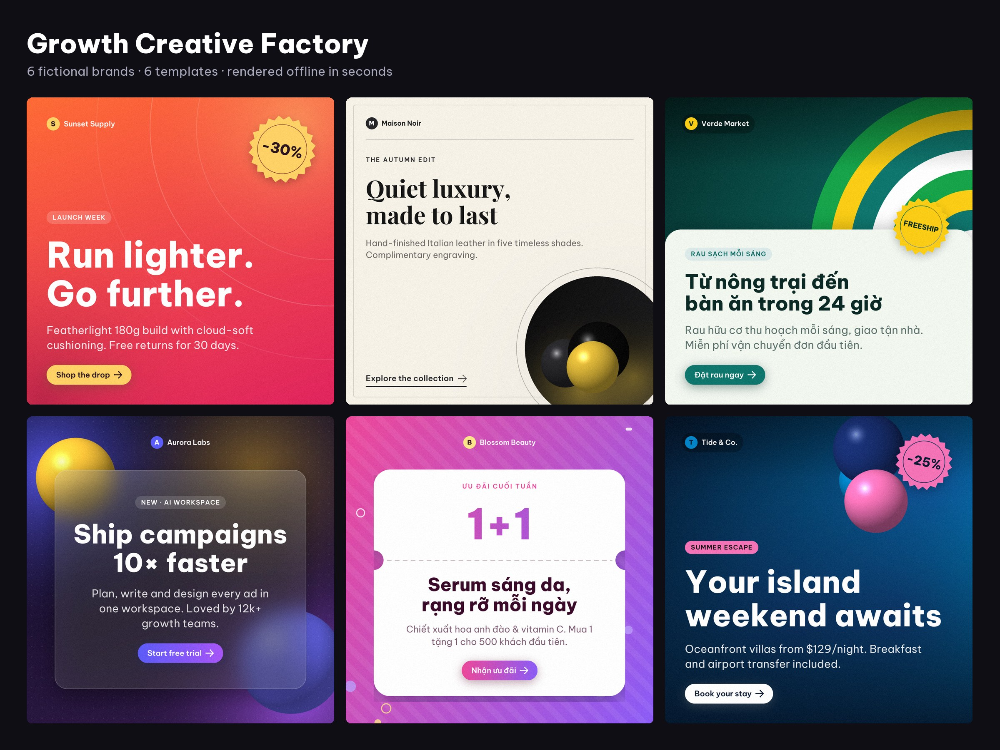
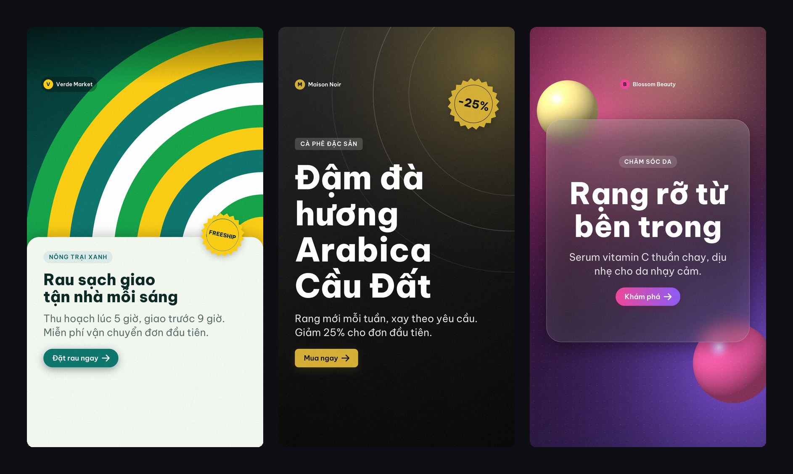
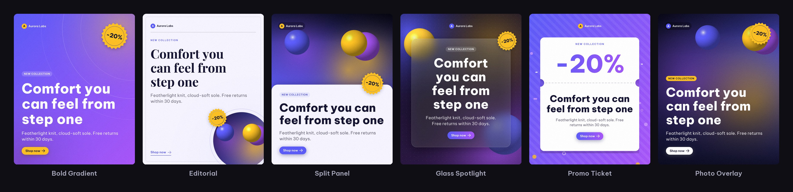

<div align="center">

# Growth Creative Factory

**Xưởng sản xuất creative mã nguồn mở cho dân performance marketing.**
Dữ liệu quảng cáo → copy do AI viết → ảnh đăng mạng xã hội đúng nhận diện thương hiệu, cho mọi vị trí hiển thị, hàng loạt.

[English](README.md) · [Tiếng Việt](README.vi.md)



<sub>Toàn bộ ảnh trên được render bởi chính repo này, chạy offline, từ vài dòng copy. Các thương hiệu đều là giả định.</sub>

</div>

---

## Vì sao cần công cụ này

Creative là đòn bẩy lớn nhất còn lại của quảng cáo mạng xã hội — nhưng lại là khâu chậm nhất.
Mỗi biến thể cần copywriter, designer, rồi resize cho từng vị trí đăng, nên đa số team chỉ test
được vài mẫu mỗi tuần.

Growth Creative Factory gói cả vòng lặp đó vào một lệnh:

1. **Tìm ad đang yếu** — import hiệu suất (CSV, Google Ads, Meta Ads), lọc theo CTR / CPA / ROAS.
2. **Viết copy tốt hơn** — Claude (hoặc copywriter offline có sẵn) chẩn đoán nguyên nhân, viết
   headline/description theo 5 góc tiếp cận, sau đó checker + bộ lọc chính sách loại bỏ nội dung vi phạm.
3. **Ra ảnh, không chỉ ra bảng tính** — mọi biến thể được render thành PNG sẵn sàng upload cho
   Feed 1:1, Feed 4:5, Stories/Reels 9:16, Link 1.91:1 và 16:9, theo brand kit của bạn.
4. **Học từ kết quả** — kết quả test quay lại memory log để vòng sau tránh các góc đã thua.

## Tính năng chính

| | |
|---|---|
| 🎨 **Creative engine** | 6 template thiết kế × 5 kích thước, brand kit, tự căn cỡ chữ, vùng an toàn cho Stories, dùng ảnh sản phẩm hoặc art tự sinh. Thuần Python (Pillow) — không cần trình duyệt, không cần Figma. |
| ✍️ **Copy đúng chuẩn** | Giới hạn ký tự (mặc định 30/90), cấm chữ IN HOA toàn bộ, blocklist chính sách ("cam kết", "tuyệt đối", "#1", "100%"…), checker AI, loại trùng lặp và đảm bảo đa dạng góc tiếp cận. |
| 🌏 **Tiếng Việt chuẩn** | Font OFL nhúng sẵn, hiển thị đầy đủ dấu tiếng Việt; copy, CTA và badge tự nhận ngôn ngữ. |
| 🧪 **Chạy thử miễn phí** | Chế độ `dry` dùng copywriter offline hiểu ngữ cảnh sản phẩm — không cần API key, không tốn phí. |
| 🔌 **Kết nối** | Kéo dữ liệu Google Ads / Meta Ads, đẩy sang Google Sheets, plugin Figma cho layout tuỳ biến. |
| 🧭 **An toàn chi phí** | Giới hạn số lần gọi API, retry có backoff, cache, xử lý refusal, kiểm tra cấu hình chặt chẽ. |
| 🖥️ **3 cách dùng** | CLI, ứng dụng Streamlit (Creative Studio + Ads Wizard) và Python API. |



## Bắt đầu nhanh (2 phút, không cần API key)

```bash
git clone https://github.com/vansyson1308/growth-creative-factory.git
cd growth-creative-factory
python -m venv .venv && source .venv/bin/activate      # Windows: .venv\Scripts\activate
pip install -e ".[ui]"                                   # hoặc: pip install -r requirements.txt
```

**1 · Từ dữ liệu quảng cáo ra creative**

```bash
gcf run --input examples/ads_sample.csv --mode dry
# mở output/gallery.html bằng trình duyệt để duyệt toàn bộ ảnh
```

**2 · Từ brief sản phẩm ra cả tuần bài đăng**

```bash
gcf create --product "Cà phê Arabica Cầu Đất" \
  --audience "dân văn phòng" --offer "Giảm 25% tuần này" \
  --benefit "Hương thơm đậm đà" --benefit "Rang mới mỗi tuần" \
  --n 8 --brand noir --formats square,story
```

**3 · Từ bảng copy bất kỳ (hoặc file TSV cho Figma) ra ảnh**

```bash
gcf render --input examples/posts_sample.csv --formats all --brand verde
```

**4 · Giao diện web**

```bash
streamlit run app.py
```

Tab **🎨 Creative Studio**: nhập brief → sinh bài → render → tải ZIP.
Tab **🧙 Ads Wizard**: upload CSV → chọn ad yếu → sinh biến thể → tải file + render ảnh.

## Template & kích thước



| Template | Phù hợp |
|---|---|
| `bold` | Quảng cáo feed cần gây chú ý, ra mắt sản phẩm |
| `editorial` | Cao cấp, thời trang, lifestyle, B2B |
| `split` | Kể chuyện sản phẩm, thương mại điện tử |
| `glass` | Công nghệ, SaaS, app, làm đẹp |
| `promo` | Sale, coupon, mua 1 tặng 1, sự kiện mùa |
| `photo` | Ảnh lifestyle, du lịch, ẩm thực |

| Format | Kích thước | Vị trí |
|---|---|---|
| `square` | 1080×1080 | Feed Facebook & Instagram, carousel |
| `portrait` | 1080×1350 | Feed 4:5 |
| `story` | 1080×1920 | Stories, Reels, TikTok (có vùng an toàn trên/dưới) |
| `landscape` | 1200×628 | Link ads Facebook, LinkedIn, Google Display |
| `wide` | 1600×900 | X/Twitter, thumbnail YouTube, slide |

## Brand kit

Có sẵn 6 preset (`gcf brands`). Với thương hiệu của bạn: sao chép
[`examples/brand_kit.yaml`](examples/brand_kit.yaml), chỉnh màu, logo, font rồi truyền
`--brand duong/dan/brand_kit.yaml` (hoặc đặt `render.brand` trong `config.yaml`).

## Chế độ live (Claude)

```bash
cp .env.example .env     # điền ANTHROPIC_API_KEY
gcf run --input input/ads.csv --mode live
```

Mặc định trong `config.yaml`: model `claude-opus-5`, `effort: low` (copy ngắn không cần suy luận sâu),
fallback khi bị từ chối, giới hạn số lần gọi mỗi lượt chạy, retry và cache SQLite.

## Kết quả mỗi lần chạy

| File | Nội dung |
|---|---|
| `output/creatives/<format>/*.png` | Ảnh sẵn sàng upload + `manifest.csv` |
| `output/gallery.html` | Trang duyệt ảnh có lọc theo format/template, chạy offline |
| `output/contact_sheet.png` | Ảnh tổng quan để gửi nhanh cho team |
| `output/new_ads.csv` | Mọi tổ hợp headline × description, tag không trùng |
| `output/figma_variations.tsv` | Dán vào plugin Figma (UTF-8, không BOM) |
| `output/handoff.csv` | Bảng duyệt có cột `status` / `notes` |
| `output/report.md` | Chẩn đoán, chiến lược và thống kê từng ad |

## Kết nối & Figma

- [Google Ads](docs/CONNECT_GOOGLE_ADS.md) · [Meta Ads](docs/CONNECT_META_ADS.md) · [Google Sheets](docs/CONNECT_GOOGLE_SHEETS.md)
- Plugin Figma: import `figma_plugin/manifest.json`, đặt tên text layer `H1` / `DESC`, dán nội dung
  `output/figma_variations.tsv` → plugin nhân bản tối đa 100 frame và export PNG.

## Phát triển

```bash
pip install -e ".[all,dev]"
black . && ruff check . && pytest -q
```

## Giấy phép

Mã nguồn: MIT ([LICENSE](LICENSE)). Font nhúng (Be Vietnam Pro, Playfair Display): SIL Open Font License.
